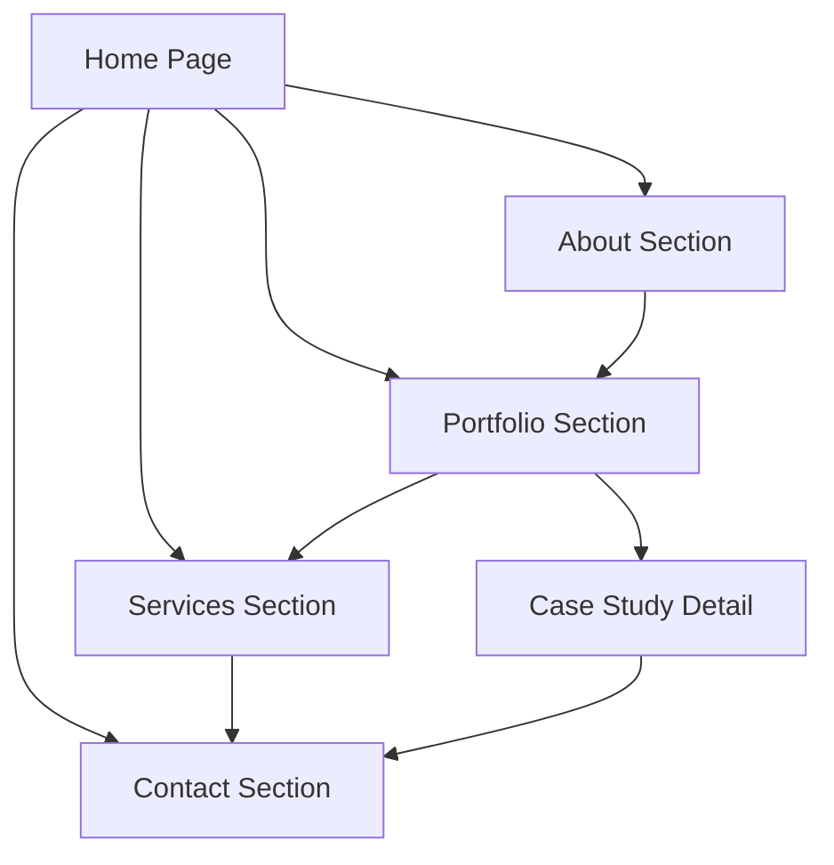

## 1. Product Overview
A modern, clean portfolio website for creative professionals to showcase their work and services. This biobricks-style portfolio serves as a digital business card and comprehensive showcase for product designers, web designers, and solopreneurs like Javier Martinez. The website solves the problem of professional presentation in the digital space, helping creative professionals attract potential clients and establish credibility through a polished online presence.

The product targets the growing market of freelance creative professionals who need a sophisticated platform to display their portfolio, communicate their services, and facilitate client contact. It provides value by creating a memorable first impression and streamlining the client acquisition process.

## 2. Core Features

### 2.1 User Roles
| Role | Registration Method | Core Permissions |
|------|---------------------|------------------|
| Site Visitor | No registration required | Browse all content, view portfolio, contact professional |
| Site Owner | Admin access | Manage content, update portfolio, configure contact settings |

### 2.2 Feature Module
The portfolio website consists of the following main pages:
1. **Home page**: Hero section with professional introduction, navigation menu, call-to-action buttons.
2. **About section**: Professional background, skills showcase, experience timeline, personal story.
3. **Portfolio/Works showcase**: Project gallery with detailed case studies, project categories, filtering options.
4. **Services section**: Service offerings, pricing tiers, process explanation, client testimonials.
5. **Contact section**: Contact form, professional links, availability status, response time information.

### 2.3 Page Details
| Page Name | Module Name | Feature description |
|-----------|-------------|---------------------|
| Home page | Hero section | Display professional headline, brief introduction, primary call-to-action button, smooth scroll animations, professional headshot or logo |
| Home page | Navigation | Sticky header with smooth scroll to sections, mobile hamburger menu, active section highlighting |
| About section | Professional background | Timeline of experience, skills grid with proficiency levels, education and certifications, professional achievements |
| About section | Personal story | Engaging narrative about design philosophy, career journey, unique value proposition, personal interests |
| Portfolio section | Project gallery | Grid layout of project cards, hover effects with project details, category filtering system, load more functionality |
| Portfolio section | Case study detail | Full project breakdown with images, problem statement, solution process, results and metrics, client testimonials |
| Services section | Service offerings | Clear service descriptions, process steps, deliverables list, turnaround times, pricing structure |
| Services section | Client testimonials | Rotating testimonials with client names and companies, project outcomes, trust badges |
| Contact section | Contact form | Name, email, project type selection, budget range, project description, file upload capability |
| Contact section | Professional links | Social media profiles, professional networks, portfolio platforms, calendar booking integration |

## 3. Core Process
**Visitor Flow:**
Visitors land on the homepage where they're immediately greeted with a compelling hero section introducing the professional. They can navigate through different sections using the smooth-scrolling navigation or scroll naturally. The portfolio section allows them to browse projects with filtering capabilities, click into detailed case studies, and ultimately reach the contact section to initiate professional engagement.

**Client Acquisition Flow:**
Potential clients discover the site through various channels, explore the portfolio to assess quality and style fit, review services to understand offerings and pricing, then use the contact form to submit project inquiries. The professional receives notifications and can respond through integrated communication channels.

## 4. User Interface Design

### 4.1 Design Style
- **Primary colors**: Professional navy (#1a1a1a), clean white (#ffffff), accent blue (#0066ff)
- **Secondary colors**: Light gray (#F2F3F7), medium gray (#6b7280), dark gray (#374151)
- **Typography**: DM Sans font family with consistent hierarchy (Hero: 48-64px, Headings: 32-48px, Body: 16-18px)
- **Button style**: Rounded corners (8-12px radius), subtle shadows, hover state animations
- **Layout style**: Card-based sections with generous whitespace, asymmetric grids for visual interest
- **Animation style**: Smooth scroll behaviors, fade-in on scroll, hover micro-interactions, loading skeletons
- **Icon style**: Minimal line icons, consistent stroke weight, professional icon set

### 4.2 Page Design Overview
| Page Name | Module Name | UI Elements |
|-----------|-------------|-------------|
| Home page | Hero section | Full-height section with #F2F3F7 background, DM Sans typography, animated text reveal, professional headshot with circular mask, primary CTA button with hover animation |
| Navigation | Header | Sticky header with blur effect, logo on left, centered navigation links, hamburger menu for mobile, smooth scroll indicators |
| Portfolio | Project grid | Masonry-style grid layout, project cards with hover overlay effects, lazy-loaded images, category filter pills, smooth filtering animations |
| Services | Service cards | Icon-based service representation, card hover effects with elevation change, process step indicators, testimonial carousel with fade transitions |
| Contact | Form section | Clean form fields with focus states, file upload drag-and-drop area, success/error message animations, professional social link buttons |

### 4.3 Responsiveness
The website is designed mobile-first with breakpoints at 640px, 768px, 1024px, and 1280px. Touch interactions are optimized with larger tap targets, swipe gestures for carousels, and simplified navigation. The layout adapts from single-column mobile views to multi-column desktop layouts while maintaining visual hierarchy and readability across all devices.