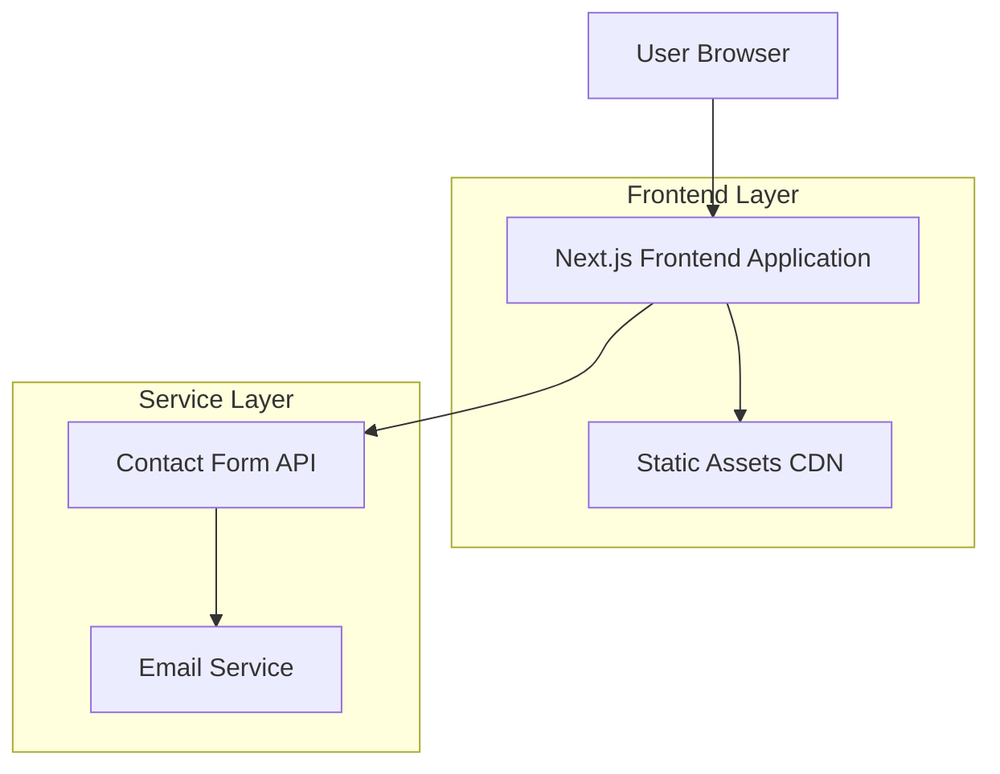
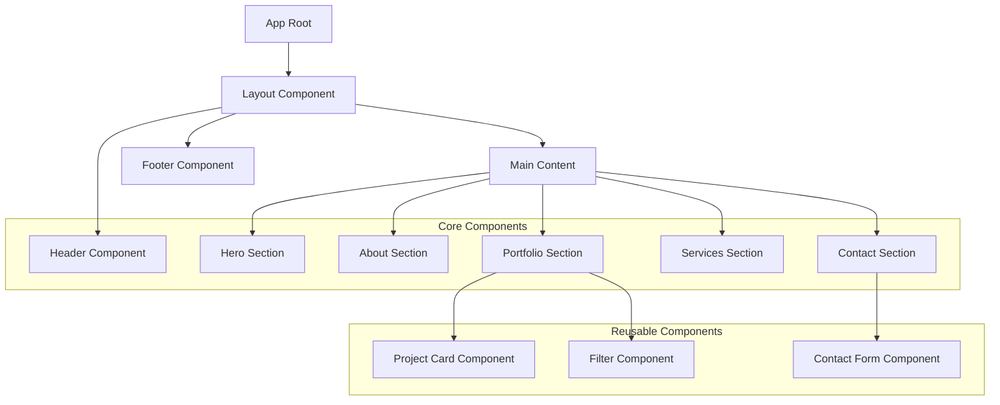

## 1. Architecture design



## 2. Technology Description
- **Frontend**: Next.js@14 + TypeScript@5 + Tailwind CSS@3 + shadcn/ui
- **Backend**: None (static site with API routes)
- **Deployment**: Vercel (recommended) or Netlify
- **Styling**: Tailwind CSS with custom configuration, CSS animations
- **Icons**: Lucide React icon library
- **Forms**: React Hook Form with Zod validation

## 3. Route definitions

| Route | Purpose |
|-------|---------|
| / | Home page with hero section and navigation to other sections |
| /#about | About section with professional background and skills |
| /#portfolio | Portfolio showcase with project gallery |
| /#services | Services offered with pricing and process |
| /#contact | Contact form and professional links |
| /api/contact | API endpoint for processing contact form submissions |

## 4. API definitions

### 4.1 Contact Form API

```
POST /api/contact
```

Request:
| Param Name | Param Type | isRequired | Description |
|------------|------------|------------|-------------|
| name | string | true | Full name of the person contacting |
| email | string | true | Valid email address |
| projectType | string | true | Type of project (web design, product design, etc.) |
| budget | string | false | Budget range for the project |
| message | string | true | Detailed project description |
| fileUrl | string | false | URL of uploaded file (if any) |

Response:
| Param Name | Param Type | Description |
|------------|------------|-------------|
| success | boolean | Whether the email was sent successfully |
| message | string | Success or error message |

Example Request:
```json
{
  "name": "John Doe",
  "email": "john@example.com",
  "projectType": "web_design",
  "budget": "5000-10000",
  "message": "I need a new website for my startup...",
  "fileUrl": "https://example.com/uploads/brief.pdf"
}
```

## 5. Component Architecture



## 6. Data Model

### 6.1 Static Data Structure
Since this is a static portfolio site, data is stored in JSON format:

```typescript
// Project Data Type
interface Project {
  id: string;
  title: string;
  description: string;
  category: 'web-design' | 'product-design' | 'branding';
  thumbnail: string;
  images: string[];
  technologies: string[];
  client: string;
  duration: string;
  outcome: string;
  link?: string;
  featured: boolean;
}

// Service Data Type
interface Service {
  id: string;
  title: string;
  description: string;
  icon: string;
  features: string[];
  startingPrice: number;
  turnaroundTime: string;
}

// Testimonial Data Type
interface Testimonial {
  id: string;
  name: string;
  company: string;
  role: string;
  content: string;
  rating: number;
  projectType: string;
}
```

### 6.2 Configuration Files

**tailwind.config.ts**
```typescript
import type { Config } from 'tailwindcss'

const config: Config = {
  content: [
    './pages/**/*.{js,ts,jsx,tsx,mdx}',
    './components/**/*.{js,ts,jsx,tsx,mdx}',
    './app/**/*.{js,ts,jsx,tsx,mdx}',
  ],
  theme: {
    extend: {
      colors: {
        background: '#F2F3F7',
        primary: '#1a1a1a',
        accent: '#0066ff',
        muted: '#6b7280',
      },
      fontFamily: {
        sans: ['DM Sans', 'sans-serif'],
      },
      animation: {
        'fade-in': 'fadeIn 0.5s ease-in-out',
        'slide-up': 'slideUp 0.5s ease-out',
      },
    },
  },
  plugins: [],
}
```

**next.config.js**
```javascript
/** @type {import('next').NextConfig} */
const nextConfig = {
  images: {
    domains: ['localhost', 'your-cdn-domain.com'],
    formats: ['image/webp', 'image/avif'],
  },
  experimental: {
    appDir: true,
  },
}

module.exports = nextConfig
```

## 7. Performance Optimization

### 7.1 Image Optimization
- Use Next.js Image component with priority loading for hero images
- Implement lazy loading for portfolio images
- Serve WebP/AVIF formats with fallbacks
- Use responsive images with srcset

### 7.2 Code Optimization
- Implement code splitting for sections
- Use dynamic imports for heavy components
- Minimize JavaScript bundle size
- Enable static generation for all pages

### 7.3 SEO Optimization
- Implement structured data (JSON-LD)
- Optimize meta tags for each section
- Generate sitemap.xml dynamically
- Configure robots.txt properly
- Implement Open Graph tags for social sharing

## 8. Security Considerations

### 8.1 Contact Form Security
- Implement rate limiting for API endpoints
- Validate and sanitize all input data
- Use environment variables for sensitive configuration
- Implement CSRF protection
- Add spam protection (honeypot fields)

### 8.2 Content Security
- Configure Content Security Policy headers
- Implement proper CORS settings
- Use HTTPS for all external resources
- Validate file uploads (type and size)